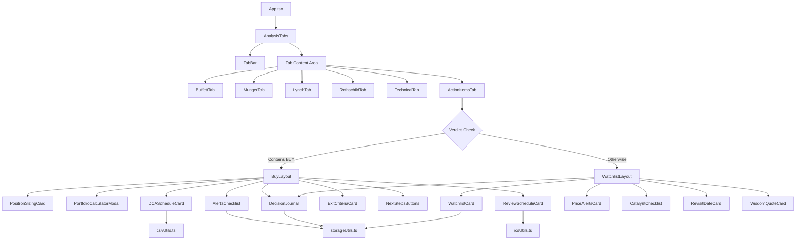
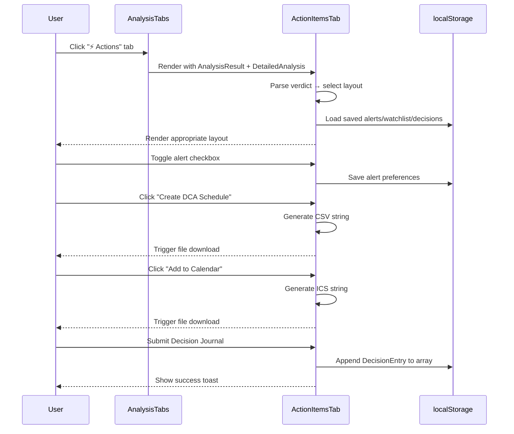

# Design Document: Action Items Tab

## Overview

The Action Items Tab adds a sixth tab ("⚡ Actions") to the existing five-tab navigation in the 4 Masters Investor application. It transforms analysis results into concrete, actionable investment recommendations. The tab conditionally renders one of two layouts based on the analysis verdict:

- **BUY Layout**: Position sizing, DCA schedule, alerts checklist, review schedule, exit criteria, and action buttons
- **Watchlist Layout**: Add to watchlist, price alerts, catalyst tracking, revisit timeline, and wisdom quote

Key interactive features include a portfolio calculator modal, CSV export of DCA schedules, ICS calendar file generation, and a Decision Journal form with localStorage persistence.

### Key Design Decisions

1. **Conditional layout via verdict parsing**: A single `ActionItemsTab` component determines layout by checking if the verdict string contains "BUY" (case-insensitive). This keeps routing logic simple and co-located.
2. **Utility modules for file generation**: CSV and ICS generation are pure functions in dedicated utility files, making them independently testable without DOM dependencies.
3. **localStorage abstraction layer**: A thin wrapper around localStorage handles JSON serialization, error handling, and graceful fallbacks, shared across alerts, watchlist, and decision journal features.
4. **Component composition over monolith**: Each card (Position Sizing, DCA, Alerts, etc.) is its own component, enabling independent testing and future reuse.
5. **Extend TabId union type**: The existing `TabId` type is extended with `'actions'` and the TabBar receives conditional styling logic for the red accent.

## Architecture



### Data Flow



## Components and Interfaces

### New Components

| Component | File | Responsibility |
|-----------|------|----------------|
| `ActionItemsTab` | `src/components/tabs/ActionItemsTab.tsx` | Root component; determines layout based on verdict |
| `BuyLayout` | `src/components/tabs/action-items/BuyLayout.tsx` | Container for all BUY-verdict cards |
| `WatchlistLayout` | `src/components/tabs/action-items/WatchlistLayout.tsx` | Container for all watchlist cards |
| `PositionSizingCard` | `src/components/tabs/action-items/PositionSizingCard.tsx` | Position allocation guidance |
| `PortfolioCalculatorModal` | `src/components/tabs/action-items/PortfolioCalculatorModal.tsx` | Modal for calculating dollar position size |
| `DCAScheduleCard` | `src/components/tabs/action-items/DCAScheduleCard.tsx` | DCA table with CSV export |
| `AlertsChecklist` | `src/components/tabs/action-items/AlertsChecklist.tsx` | Toggleable alert items with persistence |
| `ReviewScheduleCard` | `src/components/tabs/action-items/ReviewScheduleCard.tsx` | Timeline with ICS export |
| `ExitCriteriaCard` | `src/components/tabs/action-items/ExitCriteriaCard.tsx` | Warning-styled sell conditions |
| `NextStepsButtons` | `src/components/tabs/action-items/NextStepsButtons.tsx` | Primary action buttons |
| `WatchlistCard` | `src/components/tabs/action-items/WatchlistCard.tsx` | Add to watchlist button |
| `PriceAlertsCard` | `src/components/tabs/action-items/PriceAlertsCard.tsx` | Target price input |
| `CatalystChecklist` | `src/components/tabs/action-items/CatalystChecklist.tsx` | Events to watch |
| `RevisitDateCard` | `src/components/tabs/action-items/RevisitDateCard.tsx` | 6-month revisit date display |
| `WisdomQuoteCard` | `src/components/tabs/action-items/WisdomQuoteCard.tsx` | Investment wisdom quote |
| `DecisionJournal` | `src/components/tabs/action-items/DecisionJournal.tsx` | Decision recording form |

### New Utility Modules

| Module | File | Responsibility |
|--------|------|----------------|
| `csvUtils` | `src/utils/csvUtils.ts` | Generate CSV string from DCA schedule data |
| `icsUtils` | `src/utils/icsUtils.ts` | Generate ICS calendar event string |
| `storageUtils` | `src/utils/storageUtils.ts` | localStorage read/write with error handling |
| `downloadFile` | `src/utils/downloadFile.ts` | Trigger browser file download from string content |
| `verdictUtils` | `src/utils/verdictUtils.ts` | Verdict parsing and classification |
| `positionSizing` | `src/utils/positionSizing.ts` | Calculate allocation % based on risk/score |

### Component Props Interfaces

```typescript
// ActionItemsTab.tsx
interface ActionItemsTabProps {
  analysisResult: AnalysisResult;
  detailedAnalysis: DetailedAnalysis;
}

// BuyLayout.tsx
interface BuyLayoutProps {
  analysisResult: AnalysisResult;
  technicalAnalysis: TechnicalAnalysis;
}

// WatchlistLayout.tsx
interface WatchlistLayoutProps {
  analysisResult: AnalysisResult;
}

// PositionSizingCard.tsx
interface PositionSizingCardProps {
  riskLevel: string;
  overallScore: number;
  currentPrice: number;
  onOpenCalculator: () => void;
}

// PortfolioCalculatorModal.tsx
interface PortfolioCalculatorModalProps {
  isOpen: boolean;
  onClose: () => void;
  allocationPercent: number;
}

// DCAScheduleCard.tsx
interface DCAScheduleCardProps {
  ticker: string;
  totalAmount: number;
  currentPrice: number;
  technicalScore: number;
  timingVerdict: string; // 'BUY NOW' | 'WAIT' | 'AVOID'
}

// AlertsChecklist.tsx
interface AlertsChecklistProps {
  ticker: string;
}

// ReviewScheduleCard.tsx
interface ReviewScheduleCardProps {
  ticker: string;
}

// ExitCriteriaCard.tsx
interface ExitCriteriaCardProps {
  riskLevel: string;
}

// NextStepsButtons.tsx
interface NextStepsButtonsProps {
  onSaveToJournal: () => void;
  onExportPlan: () => void;
  onSetAlerts: () => void;
}

// WatchlistCard.tsx
interface WatchlistCardProps {
  ticker: string;
  companyName: string;
}

// PriceAlertsCard.tsx
interface PriceAlertsCardProps {
  ticker: string;
  currentPrice: number;
}

// CatalystChecklist.tsx
interface CatalystChecklistProps {
  ticker: string;
  verdict: string;
}

// DecisionJournal.tsx
interface DecisionJournalProps {
  ticker: string;
  companyName: string;
  currentPrice: number;
  overallScore: number;
  masterScores: { buffett: number; munger: number; lynch: number; rothschild: number };
  alertsSet: string[];
}
```

### Modified Existing Components

**TabBar.tsx**:
- Extend `TabId` type: `'buffett' | 'munger' | 'lynch' | 'rothschild' | 'technical' | 'actions'`
- Add `{ id: 'actions', label: '⚡ Actions' }` to the tabs array
- Add conditional styling: red accent (`bg-red-500`, `border-red-400`) when `tab.id === 'actions'` and active

**AnalysisTabs.tsx**:
- Import `ActionItemsTab`
- Accept additional prop: `analysisResult: AnalysisResult`
- Add `case 'actions'` to `renderTabContent()` switch

## Data Models

### New Types (added to `src/data/types.ts`)

```typescript
// Decision Journal Entry
export interface DecisionEntry {
  id: string;
  date: string; // ISO 8601 timestamp
  ticker: string;
  companyName: string;
  decision: 'BUY' | 'PASS' | 'WATCHLIST';
  positionSizePercent: number;
  positionSizeAmount: number;
  entryPriceTarget: number;
  currentPrice: number;
  reasoning: string;
  expectedOutcome: string;
  exitPlan: string;
  reviewDates: string[]; // ISO date strings
  scores: {
    buffett: number;
    munger: number;
    lynch: number;
    rothschild: number;
    overall: number;
  };
  alertsSet: string[];
  status: 'active' | 'closed';
  actualOutcome: string;
  lessonsLearned: string;
}

// Alert preferences per ticker
export interface AlertPreferences {
  [alertId: string]: boolean;
}

// DCA Schedule row
export interface DCAScheduleRow {
  month: number;
  date: string; // ISO date string
  amount: number;
  estimatedPrice: number;
  estimatedShares: number;
}

// Position sizing calculation result
export interface PositionSizingResult {
  allocationPercent: number;
  convictionLabel: 'High Conviction' | 'Standard' | 'Speculative';
  maxPositionDollars: number;
}
```

### localStorage Schema

| Key | Type | Description |
|-----|------|-------------|
| `alert_preferences_{TICKER}` | `AlertPreferences` (JSON object) | Checked/unchecked state of each alert item |
| `watchlist` | `string[]` (JSON array) | Array of ticker strings on the watchlist |
| `investment_decisions` | `DecisionEntry[]` (JSON array) | All saved decision journal entries |
| `price_alert_{TICKER}` | `{ targetPrice: number }` (JSON object) | Target buy price for watchlist stocks |

### Utility Function Signatures

```typescript
// src/utils/verdictUtils.ts
export function isBuyVerdict(verdict: string): boolean;
// Returns true if verdict contains "BUY" (case-insensitive)

// src/utils/positionSizing.ts
export function calculatePositionSizing(
  riskLevel: string,
  overallScore: number
): PositionSizingResult;

// src/utils/csvUtils.ts
export function generateDCACSV(
  ticker: string,
  schedule: DCAScheduleRow[]
): string;
// Returns CSV string with headers

// src/utils/icsUtils.ts
export function generateICSEvent(
  ticker: string,
  checkpointLabel: string,
  eventDate: Date
): string;
// Returns valid ICS file content string

// src/utils/downloadFile.ts
export function downloadFile(
  content: string,
  filename: string,
  mimeType: string
): void;
// Triggers browser download via Blob URL

// src/utils/storageUtils.ts
export function loadFromStorage<T>(key: string, fallback: T): T;
export function saveToStorage<T>(key: string, value: T): boolean;
// Returns false if localStorage is unavailable or full
```

### DCA Schedule Generation Logic

```typescript
function generateDCASchedule(
  totalAmount: number,
  currentPrice: number,
  technicalScore: number,
  timingVerdict: string
): DCAScheduleRow[] {
  const months = timingVerdict === 'WAIT' ? 6 : 4;
  const monthlyAmount = totalAmount / months;
  const variance = (16 - technicalScore) / 16 * 0.1; // 0-10% variance

  return Array.from({ length: months }, (_, i) => {
    const date = new Date();
    date.setMonth(date.getMonth() + i + 1);
    const priceVariance = 1 + (Math.random() * 2 - 1) * variance;
    const estimatedPrice = currentPrice * priceVariance;
    return {
      month: i + 1,
      date: date.toISOString().split('T')[0],
      amount: monthlyAmount,
      estimatedPrice: Math.round(estimatedPrice * 100) / 100,
      estimatedShares: Math.round((monthlyAmount / estimatedPrice) * 1000) / 1000,
    };
  });
}
```

### Position Sizing Logic

```typescript
function calculatePositionSizing(riskLevel: string, overallScore: number): PositionSizingResult {
  // Base allocation by risk level
  let minPercent: number, maxPercent: number;
  switch (riskLevel.toLowerCase()) {
    case 'low':    minPercent = 5; maxPercent = 8; break;
    case 'medium': minPercent = 3; maxPercent = 5; break;
    case 'high':   minPercent = 1; maxPercent = 3; break;
    default:       minPercent = 2; maxPercent = 4; break;
  }

  // Adjust within range based on overall score (0-10)
  const scoreRatio = overallScore / 10;
  const allocationPercent = minPercent + (maxPercent - minPercent) * scoreRatio;

  // Conviction label
  let convictionLabel: PositionSizingResult['convictionLabel'];
  if (overallScore >= 8) convictionLabel = 'High Conviction';
  else if (overallScore < 5) convictionLabel = 'Speculative';
  else convictionLabel = 'Standard';

  return {
    allocationPercent: Math.round(allocationPercent * 10) / 10,
    convictionLabel,
    maxPositionDollars: 0, // Calculated when user provides portfolio value
  };
}
```

## Correctness Properties

*A property is a characteristic or behavior that should hold true across all valid executions of a system — essentially, a formal statement about what the system should do. Properties serve as the bridge between human-readable specifications and machine-verifiable correctness guarantees.*

### Property 1: Verdict Classification is Exhaustive and Case-Insensitive

*For any* string containing "BUY" in any case variation (including "STRONG BUY", "SPECULATIVE BUY", "buy", "Buy"), `isBuyVerdict` SHALL return `true`. *For any* string that does NOT contain "BUY" in any case, `isBuyVerdict` SHALL return `false`.

**Validates: Requirements 2.1, 2.2, 2.3, 2.4**

### Property 2: Position Sizing Respects Risk Level Bounds and Conviction Labels

*For any* valid risk level ("Low", "Medium", "High") and overall score (0–10), `calculatePositionSizing` SHALL return an allocation percentage within the correct range for that risk level (Low: 5–8%, Medium: 3–5%, High: 1–3%), AND SHALL label scores ≥ 8 as "High Conviction", scores < 5 as "Speculative", and scores 5–7 as "Standard".

**Validates: Requirements 3.1, 3.5, 15.1, 15.2**

### Property 3: Portfolio Calculator Arithmetic

*For any* positive number as portfolio value and any allocation percentage (0–100), the calculated position size SHALL equal `portfolioValue * allocationPercent / 100`. *For any* non-positive or non-numeric input, validation SHALL reject the value.

**Validates: Requirements 4.2, 4.4**

### Property 4: DCA Schedule Generation Invariants

*For any* positive total amount, current price, technical score (0–16), and timing verdict, the generated DCA schedule SHALL have exactly 4 months when timing is not "WAIT" and 6 months when timing is "WAIT", each month's amount SHALL equal `totalAmount / numberOfMonths`, and all estimated prices SHALL be within ±10% of the current price.

**Validates: Requirements 5.2, 5.3, 15.3**

### Property 5: Alert Preferences Round-Trip Persistence

*For any* ticker string and any combination of alert checked/unchecked states (object mapping alert IDs to booleans), saving to localStorage and then loading SHALL return an identical object.

**Validates: Requirements 6.3, 6.5, 17.1**

### Property 6: Review Checkpoint Date Calculation

*For any* reference date, the three review checkpoints SHALL be exactly 3, 6, and 12 calendar months after the reference date (using JavaScript Date month arithmetic).

**Validates: Requirements 7.1, 7.4**

### Property 7: ICS File Generation Validity

*For any* ticker string, checkpoint label, and valid Date, the generated ICS string SHALL contain a valid VCALENDAR with a VEVENT whose SUMMARY matches "{TICKER} Investment Review - {label}" and whose DTSTART matches the input date formatted as a UTC date string.

**Validates: Requirements 14.1, 14.2, 14.3**

### Property 8: CSV File Generation Structure

*For any* DCA schedule with N rows, the generated CSV SHALL have exactly N+1 lines (1 header + N data rows), the header SHALL be "Month,Date,Amount,Estimated Price,Estimated Shares", each data row SHALL have exactly 5 comma-separated fields, and the filename SHALL match the pattern "{TICKER}_dca_schedule.csv".

**Validates: Requirements 13.1, 13.2, 13.3, 13.4**

### Property 9: Decision Journal Save/Load Round-Trip

*For any* valid DecisionEntry object, saving it to localStorage and then loading the "investment_decisions" array SHALL yield an array whose last element is deeply equal to the saved entry (with all required fields preserved).

**Validates: Requirements 11.2, 11.3**

### Property 10: Decision Journal Append-Only Invariant

*For any* sequence of N decision saves, the "investment_decisions" array in localStorage SHALL have length N, and each previously saved entry SHALL remain unchanged at its original index.

**Validates: Requirements 12.2**

### Property 11: Decision Journal Validation Rejects Incomplete Forms

*For any* form state where the Decision field is empty OR the Reasoning field is empty/whitespace-only, form submission SHALL be rejected and no entry SHALL be written to localStorage.

**Validates: Requirements 11.5**

### Property 12: Unique ID Generation

*For any* set of 1000 generated IDs, all IDs SHALL be distinct (no duplicates).

**Validates: Requirements 12.3**

### Property 13: Watchlist Deduplication (Idempotence)

*For any* ticker string, adding it to the watchlist N times (N ≥ 1) SHALL result in the watchlist array containing that ticker exactly once.

**Validates: Requirements 17.3**

### Property 14: Export Plan Contains All Required Sections

*For any* valid AnalysisResult with BUY verdict, the generated export plan text SHALL contain substrings referencing position sizing, DCA schedule, alerts, and exit criteria sections.

**Validates: Requirements 9.3**

### Property 15: Target Price Persistence Round-Trip

*For any* ticker string and positive number as target price, saving the target price to localStorage and loading it back SHALL return the same numeric value.

**Validates: Requirements 10.3**

## Error Handling

### localStorage Errors

| Scenario | Handling |
|----------|----------|
| localStorage unavailable (private browsing) | `saveToStorage` returns `false`; UI shows inline error "Could not save — storage unavailable" |
| localStorage quota exceeded | `saveToStorage` catches `QuotaExceededError`, returns `false`; UI shows error message |
| Malformed JSON in storage | `loadFromStorage` catches parse error, returns provided fallback value |
| Missing key | `loadFromStorage` returns fallback value (empty array/object) |

### Input Validation Errors

| Scenario | Handling |
|----------|----------|
| Portfolio value ≤ 0 or NaN | Modal shows inline error, calculation not performed |
| Target price ≤ 0 or NaN | Input shows inline error, value not saved |
| Decision Journal missing required fields | Inline validation messages on empty fields, submission blocked |
| Empty reasoning (whitespace only) | Treated as empty, validation error shown |

### File Generation Errors

| Scenario | Handling |
|----------|----------|
| Blob/URL creation fails | Try-catch around download logic; show toast "Download failed" |
| Invalid date for ICS | Validate date before generation; skip if invalid |

## Testing Strategy

### Property-Based Testing

The project already has `fast-check` installed. Property-based tests will use `fast-check` with Vitest.

**Configuration:**
- Minimum 100 iterations per property test
- Each test tagged with: `Feature: action-items-tab, Property {N}: {title}`
- Tests located in `src/utils/__tests__/` for utility functions

**Property tests cover:**
- `verdictUtils.ts` — Property 1 (verdict classification)
- `positionSizing.ts` — Property 2 (risk/score bounds)
- Portfolio calculation — Property 3 (arithmetic)
- DCA generation — Property 4 (schedule invariants)
- `storageUtils.ts` — Properties 5, 9, 10, 15 (round-trips, append-only)
- Date calculation — Property 6 (checkpoint dates)
- `icsUtils.ts` — Property 7 (ICS validity)
- `csvUtils.ts` — Property 8 (CSV structure)
- Validation — Property 11 (rejection of incomplete forms)
- ID generation — Property 12 (uniqueness)
- Watchlist — Property 13 (deduplication)
- Export plan — Property 14 (section completeness)

### Unit Tests (Example-Based)

Unit tests cover specific examples, UI rendering, and interactions:

- TabBar renders 6 tabs with correct labels and order
- Active "Actions" tab has red accent styling
- PositionSizingCard renders allocation and button
- PortfolioCalculatorModal opens/closes correctly
- AlertsChecklist renders 5 items, toggles work
- ExitCriteriaCard has warning styling
- DecisionJournal form renders all fields
- Success toast appears on valid submission
- Inline errors appear on invalid submission

### Integration Tests

- Full flow: search → navigate to Actions tab → verify correct layout based on verdict
- DCA CSV download triggers with correct filename
- ICS download triggers with correct filename
- Decision Journal save → reload page → data persists

### Test File Organization

```
src/
├── utils/
│   ├── __tests__/
│   │   ├── verdictUtils.test.ts        (Property 1)
│   │   ├── positionSizing.test.ts      (Properties 2, 3)
│   │   ├── csvUtils.test.ts            (Property 8)
│   │   ├── icsUtils.test.ts            (Property 7)
│   │   ├── storageUtils.test.ts        (Properties 5, 9, 10, 13, 15)
│   │   ├── dcaSchedule.test.ts         (Property 4)
│   │   ├── idGenerator.test.ts         (Property 12)
│   │   └── exportPlan.test.ts          (Property 14)
│   ├── verdictUtils.ts
│   ├── positionSizing.ts
│   ├── csvUtils.ts
│   ├── icsUtils.ts
│   ├── storageUtils.ts
│   ├── downloadFile.ts
│   └── exportPlan.ts
├── components/
│   └── tabs/
│       └── action-items/
│           └── __tests__/
│               ├── ActionItemsTab.test.tsx
│               ├── DecisionJournal.test.tsx
│               └── AlertsChecklist.test.tsx
```

