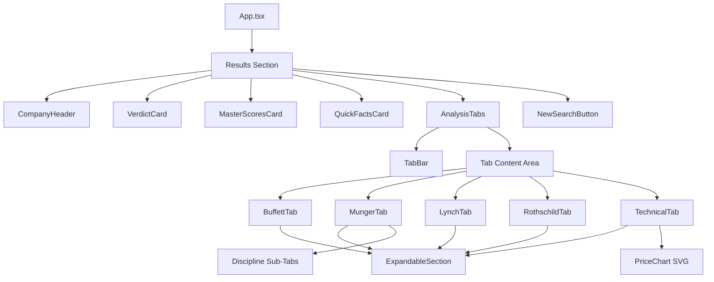
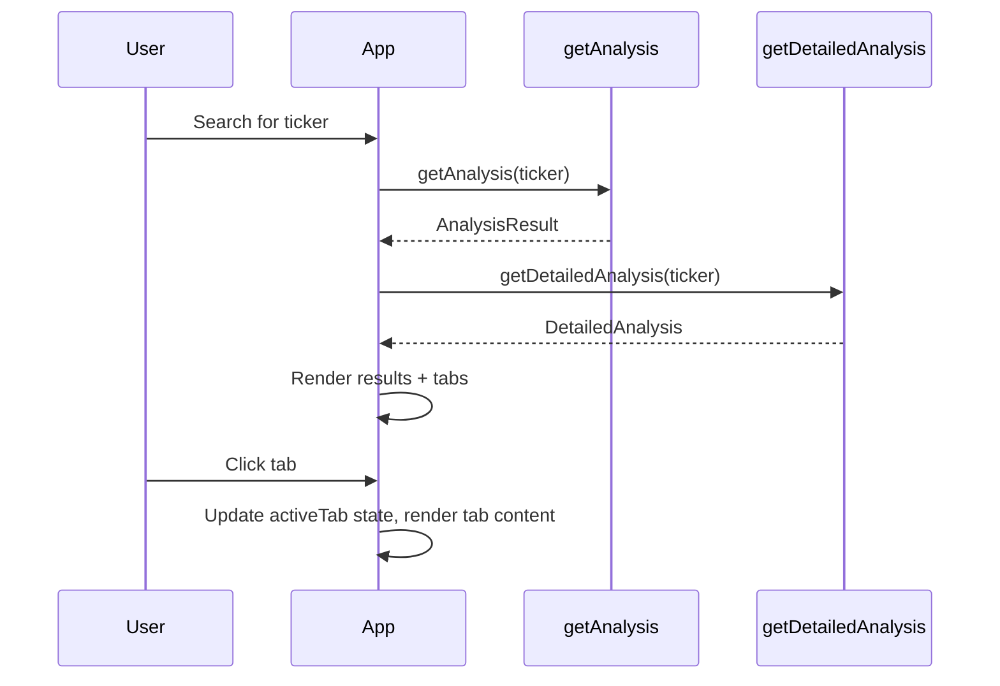

# Design Document: Analysis Tabs

## Overview

The Analysis Tabs feature extends the existing "4 Masters Investor" results page by adding a tabbed interface below the Quick Facts card. Users can navigate between five detailed analysis views — Buffett, Munger, Lynch, Rothschild, and Technical — each presenting structured investment analysis content through the lens of a specific investment philosophy.

The feature builds on the existing `AnalysisResult` type by introducing a companion `DetailedAnalysis` type that holds all tab-specific data. Mock data is generated deterministically for unknown tickers using the same seeded-random approach already established in `generatePlaceholder.ts`.

### Key Design Decisions

1. **Companion type over extension**: Rather than bloating `AnalysisResult` with tab data, a separate `DetailedAnalysis` interface keeps the existing API surface unchanged and allows lazy loading in the future.
2. **Component-per-tab pattern**: Each tab gets its own component file for isolation and maintainability.
3. **Shared ExpandableSection primitive**: A single reusable component handles expand/collapse logic across all tabs.
4. **Deterministic placeholder generation**: The existing `hashString` + `seededRandom` utilities are reused to generate detailed analysis data for arbitrary tickers.

## Architecture



### Data Flow



## Components and Interfaces

### New Components

| Component | File | Responsibility |
|-----------|------|----------------|
| `AnalysisTabs` | `src/components/AnalysisTabs.tsx` | Container managing tab state, renders TabBar + active tab content |
| `TabBar` | `src/components/TabBar.tsx` | Horizontal tab navigation with sticky positioning |
| `BuffettTab` | `src/components/tabs/BuffettTab.tsx` | Buffett analysis content |
| `MungerTab` | `src/components/tabs/MungerTab.tsx` | Munger analysis with discipline sub-tabs |
| `LynchTab` | `src/components/tabs/LynchTab.tsx` | Lynch growth analysis content |
| `RothschildTab` | `src/components/tabs/RothschildTab.tsx` | Rothschild contrarian timing content |
| `TechnicalTab` | `src/components/tabs/TechnicalTab.tsx` | Technical signals + SVG chart |
| `ExpandableSection` | `src/components/ExpandableSection.tsx` | Reusable expand/collapse wrapper |
| `PriceChart` | `src/components/PriceChart.tsx` | SVG-based price chart with support/resistance |

### Component Props Interfaces

```typescript
// AnalysisTabs.tsx
interface AnalysisTabsProps {
  data: DetailedAnalysis;
  masterScores: { buffett: number; munger: number; lynch: number; rothschild: number };
}

// TabBar.tsx
type TabId = 'buffett' | 'munger' | 'lynch' | 'rothschild' | 'technical';

interface TabBarProps {
  activeTab: TabId;
  onTabChange: (tab: TabId) => void;
}

// ExpandableSection.tsx
interface ExpandableSectionProps {
  title: string;
  defaultExpanded?: boolean; // defaults to true
  children: React.ReactNode;
}

// PriceChart.tsx
interface PriceChartProps {
  pricePoints: number[];
  supportLevel: number;
  resistanceLevel: number;
  buyZone: { low: number; high: number };
}
```

### State Management

The `AnalysisTabs` component owns the `activeTab` state (type `TabId`). When the user performs a new search, `App.tsx` unmounts and remounts the results section, which resets `activeTab` to `'buffett'` via the default state value.

Each `ExpandableSection` manages its own `isExpanded` boolean state locally.

The Munger tab's discipline sub-tabs use a local `activeDiscipline` state within `MungerTab`.

## Data Models

### DetailedAnalysis Type

```typescript
// Added to src/data/types.ts

export interface MoatFactor {
  name: string;
  status: 'pass' | 'caution' | 'fail';
  detail: string;
}

export interface FinancialMetric {
  name: string;
  value: string;
  status: 'pass' | 'caution' | 'fail';
}

export interface BuffettAnalysis {
  businessUnderstanding: {
    sector: string;
    description: string;
    complexity: 'Simple' | 'Moderate' | 'Complex';
  };
  competitiveMoat: {
    moatScore: number; // 0-10
    factors: MoatFactor[];
  };
  financialQuality: FinancialMetric[];
  managementQuality: {
    ceoTrackRecord: string;
    insiderBuying: string;
    stockCompensation: string;
    capitalAllocation: number; // 0-10
  };
  valuation: {
    intrinsicValue: number;
    currentPrice: number;
    marginOfSafety: number; // percentage
    peRatio: number;
    psRatio: number;
  };
  verdict: string;
}

export interface FailureScenario {
  name: string;
  probability: number; // 0-100
  description: string;
  mitigation: string;
  severity: 'high' | 'medium' | 'low';
}

export interface MentalModel {
  name: string;
  status: 'pass' | 'caution' | 'fail';
  explanation: string;
}

export interface MungerAnalysis {
  failureScenarios: FailureScenario[];
  mentalModels: MentalModel[];
  multiDisciplinary: {
    physics: string;
    biology: string;
    psychology: string;
    economics: string;
    history: string;
    math: string;
  };
  verdict: string;
}

export interface LynchAnalysis {
  knowWhatYouOwn: string;
  industryGrowth: {
    tam: string;
    growthRate: string;
    trend: 'Accelerating' | 'Stable' | 'Decelerating';
  };
  pegAnalysis: {
    pe: number;
    growthRate: number; // percentage
    peg: number;
    assessment: string;
  };
  tenBaggerPotential: {
    checklist: { item: string; met: boolean }[];
    path: string;
    probability: string;
  };
  verdict: string;
}

export interface ContrarianSignal {
  name: string;
  triggered: boolean;
}

export interface EntryZone {
  label: 'Best' | 'Good' | 'OK';
  priceRange: string;
  positionPercent: string;
}

export interface RothschildAnalysis {
  bloodInStreets: {
    bloodLevel: number; // 0-100
    vix: number;
    sectorPerformance: string;
    socialSentiment: number; // 0-100
    shortInterest: number; // percentage
  };
  contrarianSignals: ContrarianSignal[];
  contrarianScore: number; // 0-4
  positionSizing: {
    portfolioPercent: string;
    maxLoss: string;
    kellyCriterion: string;
  };
  entryZones: EntryZone[];
  verdict: string;
}

export interface TechnicalSignal {
  name: string;
  status: string;
  score: number;
}

export interface TechnicalAnalysis {
  timingScore: number; // 0-16
  timingVerdict: {
    recommendation: 'BUY NOW' | 'WAIT' | 'AVOID';
    buyZone: string;
    stopLoss: string;
    takeProfit: string;
  };
  signals: TechnicalSignal[];
  chartData: {
    pricePoints: number[];
    supportLevel: number;
    resistanceLevel: number;
    buyZone: { low: number; high: number };
  };
  entryStrategy: { zone: string; action: string }[];
}

export interface DetailedAnalysis {
  buffettAnalysis: BuffettAnalysis;
  mungerAnalysis: MungerAnalysis;
  lynchAnalysis: LynchAnalysis;
  rothschildAnalysis: RothschildAnalysis;
  technicalAnalysis: TechnicalAnalysis;
}
```

### Data Generation Strategy

A new function `getDetailedAnalysis(ticker: string): DetailedAnalysis` will be added to `src/data/getDetailedAnalysis.ts`. It follows the same pattern as `getAnalysis`:

1. Check `PREDEFINED_DETAILED_DATA` for known tickers (AAPL, NVDA, QTUM, PTT, AOT, CPALL).
2. Fall back to `generatePlaceholderDetailedAnalysis(ticker)` which uses the existing `hashString` + `seededRandom` utilities to produce deterministic data.

The placeholder generator reuses the same hash seed approach, consuming random values in a fixed order to ensure determinism. It picks from predefined arrays of descriptions, model names, and scenario templates.

