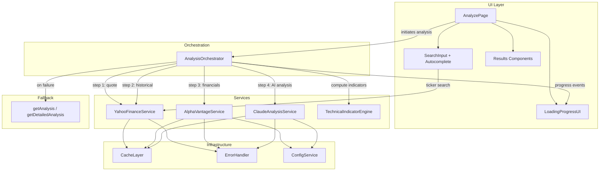
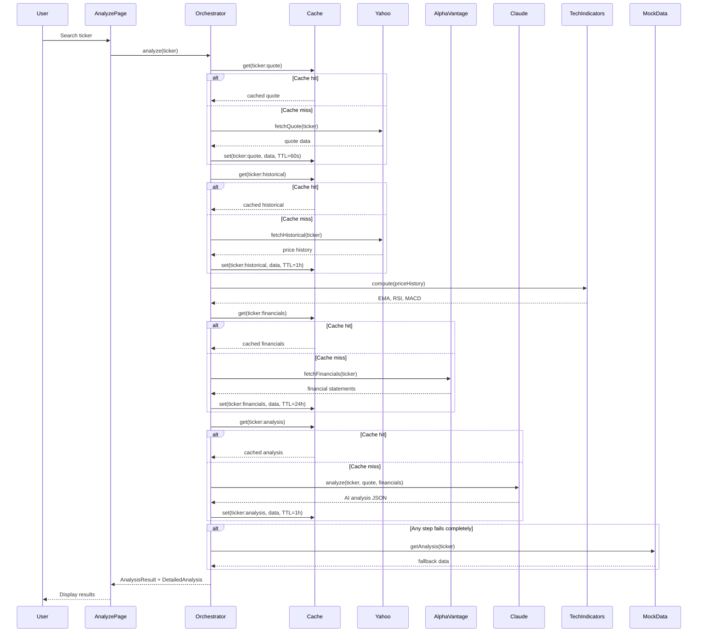

# Design Document: API Data Integration

## Overview

This design replaces the synchronous mock data layer (`getAnalysis`, `getDetailedAnalysis`, `generatePlaceholder*`) with an asynchronous service architecture that fetches real data from Yahoo Finance, Alpha Vantage, and Claude AI APIs. The system introduces a caching layer, centralized error handling, client-side technical indicator computation, a multi-step loading UI, and search autocomplete — all while preserving the existing `AnalysisResult` and `DetailedAnalysis` type contracts so downstream components remain unchanged.

### Key Design Decisions

1. **Service-per-API pattern**: Each external API gets its own service module (`yahooFinanceService`, `alphaVantageService`, `claudeAnalysisService`) for isolation and independent testability.
2. **Orchestrator pattern**: A single `analysisOrchestrator` coordinates the multi-step fetch sequence, reports progress, and handles fallback logic.
3. **Cache-first strategy**: All API calls check the cache before making network requests, with per-data-type TTLs.
4. **Graceful degradation**: Every API failure falls back to existing mock data generators, ensuring the app never breaks.
5. **Client-side CORS proxy consideration**: Yahoo Finance and Alpha Vantage APIs may require a lightweight CORS proxy or use JSONP/direct endpoints. The design abstracts the fetch layer so proxy configuration is a single-point change.

## Architecture



### Data Flow Sequence



## Components and Interfaces

### 1. CacheLayer (`src/services/cacheLayer.ts`)

```typescript
interface CacheEntry<T> {
  data: T;
  timestamp: number;
  ttl: number; // milliseconds
}

interface CacheLayer {
  get<T>(key: string): T | null;
  set<T>(key: string, data: T, ttlMs: number): void;
  has(key: string): boolean;
  invalidate(key: string): void;
  clear(): void;
}

// Cache key format: `${ticker}:${dataType}`
// Example: "AAPL:quote", "AAPL:historical", "AAPL:financials", "AAPL:analysis"
```

TTL configuration constants:
- `QUOTE_TTL = 60_000` (1 minute)
- `HISTORICAL_TTL = 3_600_000` (1 hour)
- `FINANCIALS_TTL = 86_400_000` (24 hours)
- `ANALYSIS_TTL = 3_600_000` (1 hour)

### 2. ErrorHandler (`src/services/errorHandler.ts`)

```typescript
type ApiErrorType = 'NOT_FOUND' | 'RATE_LIMIT' | 'NETWORK' | 'TIMEOUT' | 'UNKNOWN';

interface ApiError {
  type: ApiErrorType;
  message: string;        // user-facing message
  technicalDetails: string; // for console logging
  retryable: boolean;
}

interface ErrorHandler {
  classify(error: unknown, context: string): ApiError;
  toUserMessage(apiError: ApiError): string;
}
```

### 3. ConfigService (`src/services/configService.ts`)

```typescript
interface ApiConfig {
  alphaVantageKey: string | null;
  anthropicKey: string | null;
  yahooFinanceBaseUrl: string;
  alphaVantageBaseUrl: string;
  claudeBaseUrl: string;
  requestTimeoutMs: number;
}

function getApiConfig(): ApiConfig;
function isAlphaVantageConfigured(): boolean;
function isClaudeConfigured(): boolean;
```

### 4. YahooFinanceService (`src/services/yahooFinanceService.ts`)

```typescript
interface StockQuote {
  ticker: string;
  price: number;
  priceChangePercent: number;
  marketCap: number;
  weekRange52: { low: number; high: number };
  volume: number;
  companyName: string;
  sector: string;
}

interface HistoricalDataPoint {
  date: string; // ISO date
  adjustedClose: number;
}

interface SearchResult {
  ticker: string;
  companyName: string;
  exchange: string;
}

interface YahooFinanceService {
  fetchQuote(ticker: string): Promise<StockQuote>;
  fetchHistoricalData(ticker: string, months?: number): Promise<HistoricalDataPoint[]>;
  searchTickers(query: string): Promise<SearchResult[]>;
}
```

### 5. AlphaVantageService (`src/services/alphaVantageService.ts`)

```typescript
interface FinancialStatements {
  incomeStatements: AnnualIncomeStatement[];
  balanceSheets: AnnualBalanceSheet[];
  cashFlowStatements: AnnualCashFlow[];
}

interface AnnualIncomeStatement {
  fiscalYear: string;
  revenue: number;
  netIncome: number;
  grossProfit: number;
  operatingIncome: number;
}

interface AnnualBalanceSheet {
  fiscalYear: string;
  totalAssets: number;
  totalLiabilities: number;
  totalEquity: number;
  cashAndEquivalents: number;
}

interface AnnualCashFlow {
  fiscalYear: string;
  operatingCashFlow: number;
  capitalExpenditures: number;
  freeCashFlow: number;
}

interface CompanyOverview {
  sector: string;
  marketCap: number;
  peRatio: number;
  profitMargin: number;
  debtToEquity: number;
  description: string;
}

interface AlphaVantageService {
  fetchFinancialStatements(ticker: string): Promise<FinancialStatements>;
  fetchCompanyOverview(ticker: string): Promise<CompanyOverview>;
}
```

### 6. ClaudeAnalysisService (`src/services/claudeAnalysisService.ts`)

```typescript
interface AnalysisInput {
  ticker: string;
  quote: StockQuote;
  financials: FinancialStatements | null;
  companyOverview: CompanyOverview | null;
  technicalIndicators: TechnicalIndicators | null;
}

interface ClaudeAnalysisService {
  analyze(input: AnalysisInput): Promise<{
    analysisResult: AnalysisResult;
    detailedAnalysis: DetailedAnalysis;
  }>;
}
```

### 7. TechnicalIndicatorEngine (`src/services/technicalIndicatorEngine.ts`)

```typescript
interface TechnicalIndicators {
  ema12: number | null;
  ema26: number | null;
  rsi14: number | null;
  macd: {
    macdLine: number;
    signalLine: number;
    histogram: number;
  } | null;
}

interface TechnicalIndicatorEngine {
  compute(prices: number[]): TechnicalIndicators;
}
```

### 8. AnalysisOrchestrator (`src/services/analysisOrchestrator.ts`)

```typescript
type AnalysisStage = 'quote' | 'historical' | 'financials' | 'analysis';
type StageStatus = 'pending' | 'loading' | 'complete' | 'error';

interface StageProgress {
  stage: AnalysisStage;
  status: StageStatus;
  error?: string;
}

interface AnalysisOrchestrator {
  analyze(
    ticker: string,
    onProgress: (stages: StageProgress[]) => void
  ): Promise<{
    analysisResult: AnalysisResult;
    detailedAnalysis: DetailedAnalysis;
    isFallback: boolean;
  }>;
}
```

### 9. SearchAutocomplete Component (`src/components/SearchAutocomplete.tsx`)

```typescript
interface SearchAutocompleteProps {
  value: string;
  onChange: (value: string) => void;
  onSearch: (ticker: string) => void;
}

// Internal state manages:
// - suggestions: SearchResult[]
// - isOpen: boolean (dropdown visibility)
// - debounce timer (300ms)
// - loading state
```

### 10. LoadingProgressUI Component (`src/components/LoadingProgress.tsx`)

```typescript
interface LoadingProgressProps {
  stages: StageProgress[];
}

// Renders a vertical stepper showing:
// - Stage name
// - Status icon (spinner, checkmark, error X)
// - Current stage highlighted
```

## Data Models

### API Response Mapping

The services map external API responses to the existing `AnalysisResult` and `DetailedAnalysis` types. Here's how fields are sourced:

| AnalysisResult Field | Primary Source | Fallback Source |
|---------------------|---------------|-----------------|
| `ticker` | Input | Input |
| `companyName` | Yahoo Finance quote | Alpha Vantage overview |
| `price` | Yahoo Finance quote | Mock data |
| `priceChange` | Yahoo Finance quote | Mock data |
| `verdict` | Claude AI analysis | Mock data |
| `positionSize` | Claude AI analysis | Mock data |
| `entryStrategy` | Claude AI analysis | Mock data |
| `riskLevel` | Claude AI analysis | Mock data |
| `timeHorizon` | Claude AI analysis | Mock data |
| `masterScores` | Claude AI analysis | Mock data |
| `overallScore` | Claude AI analysis | Mock data |
| `quickFacts.marketCap` | Yahoo Finance / Alpha Vantage | Mock data |
| `quickFacts.priceSales` | Alpha Vantage overview | Mock data |
| `quickFacts.cashRunway` | Alpha Vantage financials (computed) | Mock data |
| `quickFacts.sector` | Alpha Vantage overview / Yahoo Finance | Mock data |
| `quickFacts.weekRange52` | Yahoo Finance quote | Mock data |
| `quickFacts.moat` | Claude AI analysis | Mock data |
| `quickFacts.profitMargin` | Alpha Vantage overview | Mock data |
| `quickFacts.debtEquity` | Alpha Vantage overview | Mock data |

### Cache Key Schema

```
Format: "{TICKER}:{dataType}"

Examples:
  "AAPL:quote"       → StockQuote (TTL: 1 min)
  "AAPL:historical"  → HistoricalDataPoint[] (TTL: 1 hour)
  "AAPL:financials"  → FinancialStatements (TTL: 24 hours)
  "AAPL:overview"    → CompanyOverview (TTL: 24 hours)
  "AAPL:analysis"    → { analysisResult, detailedAnalysis } (TTL: 1 hour)
```

### Environment Variables

```
VITE_ALPHA_VANTAGE_KEY=<your-alpha-vantage-api-key>
VITE_ANTHROPIC_API_KEY=<your-anthropic-api-key>
```

Both are optional. The app degrades gracefully when either is missing.

## Correctness Properties

*A property is a characteristic or behavior that should hold true across all valid executions of a system — essentially, a formal statement about what the system should do. Properties serve as the bridge between human-readable specifications and machine-verifiable correctness guarantees.*

### Property 1: Ticker normalization is idempotent and produces uppercase

*For any* string input to the ticker normalization function, the output SHALL be the uppercase-trimmed version of the input, and applying normalization twice SHALL produce the same result as applying it once.

**Validates: Requirements 1.4**

### Property 2: Yahoo Finance response mapping produces valid AnalysisResult fields

*For any* valid Yahoo Finance API quote response object, mapping it to AnalysisResult fields SHALL produce a result where price is a positive number, priceChange is a finite number, marketCap is a non-empty string, and weekRange52 is a non-empty string.

**Validates: Requirements 1.2, 5.2**

### Property 3: Historical data output is sorted chronologically

*For any* valid array of date-price pairs returned from the Yahoo Finance historical API, the mapped output SHALL be sorted in ascending chronological order (oldest date first, newest date last).

**Validates: Requirements 2.2**

### Property 4: Cache round-trip preserves data before TTL expiry

*For any* data value and any positive TTL, storing the value in the cache and retrieving it before the TTL expires SHALL return a value equal to the original stored value.

**Validates: Requirements 7.5**

### Property 5: Cache returns null after TTL expiry

*For any* data value stored in the cache with a given TTL, retrieving it after the TTL has elapsed SHALL return null.

**Validates: Requirements 7.6**

### Property 6: Cache key uniqueness

*For any* two distinct (ticker, dataType) pairs, the generated cache keys SHALL be different. For any identical (ticker, dataType) pair, the generated cache key SHALL be the same.

**Validates: Requirements 7.7**

### Property 7: Error classification by HTTP status

*For any* HTTP error response, the error handler SHALL classify 404 responses as NOT_FOUND, 429 responses as RATE_LIMIT, network errors (timeout, DNS, connection) as NETWORK, and all other errors as UNKNOWN.

**Validates: Requirements 8.1, 8.2, 8.3, 8.4**

### Property 8: Error object structural invariant

*For any* error input to the error handler, the resulting ApiError object SHALL always contain a non-empty `type`, a non-empty `message` (user-facing), and a non-empty `technicalDetails` string.

**Validates: Requirements 8.5**

### Property 9: RSI is bounded between 0 and 100

*For any* array of at least 14 positive price values, the computed RSI SHALL be a number between 0 and 100 (inclusive).

**Validates: Requirements 10.2**

### Property 10: MACD histogram equals MACD line minus signal line

*For any* array of at least 26 positive price values where MACD can be computed, the histogram value SHALL equal the MACD line value minus the signal line value (within floating-point tolerance).

**Validates: Requirements 10.3**

### Property 11: Insufficient data returns null indicators

*For any* price array with fewer than 26 data points, the Technical Indicator Engine SHALL return null for EMA-26 and MACD. For any price array with fewer than 14 data points, it SHALL also return null for RSI.

**Validates: Requirements 10.5**

### Property 12: Search autocomplete threshold

*For any* input string with fewer than 2 characters, the search autocomplete SHALL NOT trigger an API request. For any input string with 2 or more characters, it SHALL trigger a (debounced) API request.

**Validates: Requirements 3.1**

### Property 13: Complete fallback on total API failure

*For any* ticker symbol where all API calls fail, the orchestrator SHALL return data that matches the structure produced by the existing `getAnalysis` and `getDetailedAnalysis` mock functions for that ticker, with `isFallback` set to true.

**Validates: Requirements 12.1**

### Property 14: Claude prompt includes all provided data

*For any* valid AnalysisInput containing a stock quote and financial data, the constructed Claude API prompt SHALL contain the ticker symbol, current price, and all non-null financial metrics from the input.

**Validates: Requirements 6.6**

## Error Handling

### Error Classification Strategy

All API errors flow through the centralized `ErrorHandler` which classifies them into typed errors:

| HTTP Status / Error Type | Classification | User Message | Retryable |
|--------------------------|---------------|--------------|-----------|
| 404 / Not Found | `NOT_FOUND` | "Ticker symbol not recognized. Please check the symbol and try again." | No |
| 429 / Rate Limit | `RATE_LIMIT` | "Too many requests. Please wait a moment before trying again." | Yes |
| Timeout / DNS / Connection | `NETWORK` | "Network connection issue. Please check your internet and try again." | Yes |
| 5xx / Unknown | `UNKNOWN` | "Something went wrong. Please try again later." | Yes |

### Fallback Cascade

Each service has its own fallback strategy:

1. **YahooFinanceService**: On failure → return `Fallback_Data` from `getAnalysis(ticker)`
2. **AlphaVantageService**: On failure → use Yahoo Finance data as partial fallback for overview; return empty financials
3. **ClaudeAnalysisService**: On failure → return `Fallback_Data` from `getAnalysis` + `getDetailedAnalysis`
4. **Orchestrator level**: If ALL services fail → full fallback to mock data with `isFallback: true` flag

### Error Logging

- All errors are logged to `console.error` with full technical details
- Missing API key warnings are logged to `console.warn` at startup
- User-facing messages never expose technical details, API keys, or internal URLs

### Timeout Configuration

- All API requests use a 15-second timeout
- The Claude API request uses a 30-second timeout (LLM responses are slower)

## Testing Strategy

### Property-Based Testing (fast-check)

The project already uses `fast-check` (v4.7.0). Property-based tests will be written for all correctness properties defined above.

**Configuration:**
- Minimum 100 iterations per property test
- Each test tagged with: `Feature: api-data-integration, Property {N}: {title}`
- Test files: `src/services/*.property.test.ts`

**Property test targets:**
- `cacheLayer.property.test.ts` — Properties 4, 5, 6 (cache round-trip, expiry, key uniqueness)
- `errorHandler.property.test.ts` — Properties 7, 8 (error classification, structural invariant)
- `technicalIndicatorEngine.property.test.ts` — Properties 9, 10, 11 (RSI bounds, MACD histogram, null on insufficient data)
- `yahooFinanceService.property.test.ts` — Properties 1, 2, 3 (normalization, mapping, sorting)
- `analysisOrchestrator.property.test.ts` — Property 13 (fallback on total failure)
- `claudeAnalysisService.property.test.ts` — Property 14 (prompt completeness)
- `searchAutocomplete.property.test.ts` — Property 12 (threshold behavior)

### Unit Testing (vitest)

Example-based unit tests for:
- Specific API response mapping scenarios with real-world sample data
- Debounce behavior (timing-based tests)
- Environment variable missing/present scenarios
- Loading progress stage transitions
- Fallback indicator display logic

### Integration Testing

- Manual integration tests with real API keys (not run in CI)
- Documented in a `TESTING.md` file with instructions for running against live APIs
- Verify end-to-end flow: search → fetch → display

### Test File Organization

```
src/services/
  cacheLayer.ts
  cacheLayer.test.ts
  cacheLayer.property.test.ts
  errorHandler.ts
  errorHandler.test.ts
  errorHandler.property.test.ts
  technicalIndicatorEngine.ts
  technicalIndicatorEngine.test.ts
  technicalIndicatorEngine.property.test.ts
  yahooFinanceService.ts
  yahooFinanceService.test.ts
  yahooFinanceService.property.test.ts
  alphaVantageService.ts
  alphaVantageService.test.ts
  claudeAnalysisService.ts
  claudeAnalysisService.test.ts
  claudeAnalysisService.property.test.ts
  analysisOrchestrator.ts
  analysisOrchestrator.test.ts
  analysisOrchestrator.property.test.ts
  configService.ts
  configService.test.ts
```

