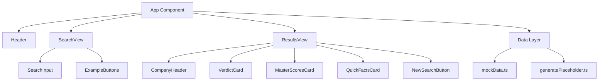
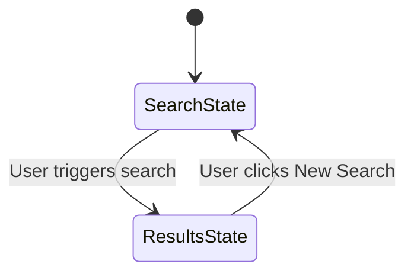

# Design Document: 4 Masters Investor

## Overview

The "4 Masters Investor" is a single-page React application that provides stock analysis based on the investment philosophies of four legendary investors: Warren Buffett, Charlie Munger, Peter Lynch, and Baron Rothschild. The app uses Tailwind CSS for styling with a dark theme, supports US and Thai (SET) stock tickers, and uses mock data for analysis results.

The application follows a simple flow: user enters a ticker → app looks up or generates analysis data → displays results with animations. The architecture prioritizes simplicity since this is a client-side-only app with no backend.

### Key Design Decisions

1. **Single-file vs multi-file**: Split into focused components for maintainability, but keep the data layer minimal (one mock data module).
2. **Mock data strategy**: Predefined data for select tickers (QTUM, AAPL, NVDA, PTT, AOT, CPALL) with a deterministic generator for unknown tickers — ensuring the same ticker always produces the same placeholder data.
3. **State management**: React useState hooks — no external state library needed for this scope.
4. **Animation approach**: Tailwind CSS custom animations via configuration, supplemented by smooth scroll API.

## Architecture



### Application States



The app has two primary states:
- **SearchState**: Shows centered search input with example buttons
- **ResultsState**: Shows full analysis results with all cards

## Components and Interfaces

### App (Root Component)

```typescript
// App.tsx
interface AppState {
  view: 'search' | 'results';
  ticker: string;
  analysisData: AnalysisResult | null;
}
```

Responsibilities:
- Manages top-level view state (search vs results)
- Orchestrates search flow
- Renders Header and conditionally renders SearchView or ResultsView

### Header

```typescript
// components/Header.tsx
const Header: React.FC = () => { ... }
```

- Renders full-width header with logo/title "🎯 4 Masters Investment Advisor"
- Styled with bg-gray-900, text-white, p-6, text-2xl, font-bold

### SearchInput

```typescript
// components/SearchInput.tsx
interface SearchInputProps {
  value: string;
  onChange: (value: string) => void;
  onSearch: (ticker: string) => void;
}
```

- Controlled input with Enter key handler
- Styled with text-xl, rounded-lg, p-4, border-2 border-blue-500
- Focus ring glow effect via focus:ring-2 focus:ring-blue-400

### ExampleButtons

```typescript
// components/ExampleButtons.tsx
interface ExampleButtonsProps {
  onSelect: (ticker: string) => void;
}
```

- Renders three buttons: QTUM, AAPL, NVDA
- Styled with bg-gray-800, hover:bg-gray-700, px-4, py-2, rounded
- Clicking populates search and triggers analysis

### CompanyHeader

```typescript
// components/CompanyHeader.tsx
interface CompanyHeaderProps {
  ticker: string;
  companyName: string;
  price: number;
  priceChange: number; // percentage, negative = down
}
```

- Displays ticker + company name
- Shows price in large text
- Conditionally renders green (▲) or red (▼) change indicator

### VerdictCard

```typescript
// components/VerdictCard.tsx
interface VerdictCardProps {
  verdict: string;
  positionSize: string;
  entryStrategy: string;
  riskLevel: string;
  timeHorizon: string;
}
```

- Gradient background (bg-gradient-to-br from-blue-900 to-purple-900)
- Displays verdict in text-4xl font-black text-green-400
- Lists strategy details with appropriate styling

### MasterScoresCard

```typescript
// components/MasterScoresCard.tsx
interface MasterScore {
  name: string;
  score: number; // 0-10
  color: string; // Tailwind color class
}

interface MasterScoresCardProps {
  scores: MasterScore[];
  overallScore: number;
}
```

- Renders four score bars with colored fills
- Each bar shows: master name (w-32), progress bar (h-6), numeric score
- Overall score at bottom with gradient bar

### QuickFactsCard

```typescript
// components/QuickFactsCard.tsx
interface QuickFact {
  label: string;
  value: string;
}

interface QuickFactsCardProps {
  facts: QuickFact[];
}
```

- 2-column grid on desktop, 1-column on mobile (grid-cols-1 md:grid-cols-2)
- Label in gray-400, value in white font-semibold

### NewSearchButton

```typescript
// components/NewSearchButton.tsx
interface NewSearchButtonProps {
  onClick: () => void;
}
```

- Styled with bg-blue-500, hover:bg-blue-600, px-6, py-3, rounded-lg
- Triggers return to search state

## Data Models

### AnalysisResult

```typescript
// data/types.ts
interface AnalysisResult {
  ticker: string;
  companyName: string;
  price: number;
  priceChange: number; // percentage
  verdict: string;
  positionSize: string;
  entryStrategy: string;
  riskLevel: string;
  timeHorizon: string;
  masterScores: {
    buffett: number;  // 0-10
    munger: number;   // 0-10
    lynch: number;    // 0-10
    rothschild: number; // 0-10
  };
  overallScore: number; // 0-10
  quickFacts: {
    marketCap: string;
    priceSales: string;
    cashRunway: string;
    sector: string;
    weekRange52: string;
    moat: string;
    profitMargin: string;
    debtEquity: string;
  };
}
```

### Mock Data Module

```typescript
// data/mockData.ts
const PREDEFINED_DATA: Record<string, AnalysisResult> = {
  'QTUM': { /* full analysis */ },
  'AAPL': { /* full analysis */ },
  'NVDA': { /* full analysis */ },
  'PTT': { /* full analysis */ },
  'AOT': { /* full analysis */ },
  'CPALL': { /* full analysis */ },
};
```

### Placeholder Generator

```typescript
// data/generatePlaceholder.ts

/**
 * Generates deterministic placeholder analysis data for any ticker
 * not found in the predefined set. Uses a simple hash of the ticker
 * string to seed consistent values.
 */
function generatePlaceholderAnalysis(ticker: string): AnalysisResult;
```

The generator uses a string hash function to derive deterministic numeric values from the ticker, ensuring:
- Same ticker always produces same results
- Scores fall within valid ranges (0-10)
- Price and financial metrics are realistic
- Company name is derived as "{TICKER} Corp." for unknown tickers

### Data Lookup Function

```typescript
// data/getAnalysis.ts

/**
 * Main entry point for fetching analysis data.
 * Performs case-insensitive lookup against predefined data,
 * falls back to placeholder generation.
 */
function getAnalysis(ticker: string): AnalysisResult;
```

Logic:
1. Normalize ticker to uppercase (case-insensitive matching)
2. Check predefined data map
3. If not found, call generatePlaceholderAnalysis
4. Return result (never returns null/error)


## Correctness Properties

*A property is a characteristic or behavior that should hold true across all valid executions of a system — essentially, a formal statement about what the system should do. Properties serve as the bridge between human-readable specifications and machine-verifiable correctness guarantees.*

### Property 1: Totality of analysis lookup

*For any* non-empty string used as a ticker symbol, `getAnalysis(ticker)` SHALL return a complete `AnalysisResult` object with all required fields populated (ticker, companyName, price, priceChange, verdict, masterScores, quickFacts) — never null, never an error, never missing fields.

**Validates: Requirements 10.1, 10.4, 10.5**

### Property 2: Case-insensitive equivalence

*For any* ticker string, `getAnalysis(ticker.toLowerCase())` SHALL produce an identical `AnalysisResult` to `getAnalysis(ticker.toUpperCase())`.

**Validates: Requirements 10.3**

### Property 3: Deterministic placeholder generation

*For any* ticker string not in the predefined data set, calling `generatePlaceholderAnalysis(ticker)` multiple times SHALL always return the same `AnalysisResult`.

**Validates: Requirements 10.4, 10.5**

### Property 4: Score values within valid range

*For any* ticker string, all scores in the returned `AnalysisResult` (buffett, munger, lynch, rothschild, overallScore) SHALL be numbers in the range [0, 10].

**Validates: Requirements 7.4, 7.5**

### Property 5: Price change indicator correctness

*For any* `priceChange` value, the `CompanyHeader` component SHALL render a down arrow (▼) with `text-red-500` class when `priceChange < 0`, and an up arrow (▲) with `text-green-500` class when `priceChange > 0`.

**Validates: Requirements 5.3, 5.4**

### Property 6: Score bar proportionality

*For any* score value in the range [0, 10], the rendered score bar width percentage SHALL equal `(score / 10) * 100`.

**Validates: Requirements 7.4, 7.5**

## Error Handling

Since this is a client-side application with mock data and no network calls, error scenarios are minimal:

| Scenario | Handling |
|----------|----------|
| Empty ticker input | Prevent search trigger (Enter key ignored when input is empty) |
| Unknown ticker | Generate placeholder data — never show an error |
| Whitespace-only input | Trim input; treat as empty if result is empty string |
| Special characters in ticker | Normalize to uppercase, generate placeholder data |

### Design Principle: No Error States Visible to User

The app is designed so that any non-empty input produces valid results. There are no loading states (mock data is synchronous), no network errors, and no "not found" messages. This simplifies the UX significantly.

## Testing Strategy

### Unit Tests (Example-Based)

Unit tests cover specific rendering and interaction behaviors:

- **Header**: Renders title text with correct styling classes
- **SearchInput**: Displays placeholder, triggers onSearch on Enter, ignores Enter when empty
- **ExampleButtons**: Renders three buttons, calls onSelect with correct ticker on click
- **ResultsView**: Renders all four sub-components in correct order
- **CompanyHeader**: Displays ticker, company name, and formatted price
- **VerdictCard**: Displays verdict text and all strategy details
- **MasterScoresCard**: Renders four score bars with correct color assignments
- **QuickFactsCard**: Renders all 8 facts in grid layout
- **NewSearchButton**: Calls onClick handler when clicked
- **App state transitions**: Search → Results → Search flow works correctly
- **Predefined data**: Includes both US (AAPL, NVDA, QTUM) and Thai (PTT, AOT, CPALL) tickers

### Property-Based Tests

Property-based tests validate universal correctness guarantees using `fast-check`:

| Property | Test Description | Min Iterations |
|----------|-----------------|----------------|
| Property 1: Totality | Generate arbitrary non-empty strings, verify getAnalysis always returns complete result | 100 |
| Property 2: Case insensitivity | Generate arbitrary strings, verify case variations produce same result | 100 |
| Property 3: Determinism | Generate arbitrary strings, verify repeated calls return same result | 100 |
| Property 4: Score range | Generate arbitrary tickers, verify all scores are in [0, 10] | 100 |
| Property 5: Price indicator | Generate arbitrary numbers, verify correct arrow/color for sign | 100 |
| Property 6: Bar proportionality | Generate scores in [0, 10], verify width calculation | 100 |

**Library**: `fast-check` (JavaScript/TypeScript property-based testing library)

**Tag format**: Each property test will include a comment:
```
// Feature: four-masters-investor, Property {N}: {property_text}
```

### Integration Tests

- Smooth scroll is called when results appear (mock `scrollIntoView`)
- Fade-in animation class is applied to results container

### Test Tools

- **Test runner**: Vitest
- **Component testing**: React Testing Library
- **Property testing**: fast-check
- **Coverage target**: All data layer functions at 100%, components at high coverage for logic paths
