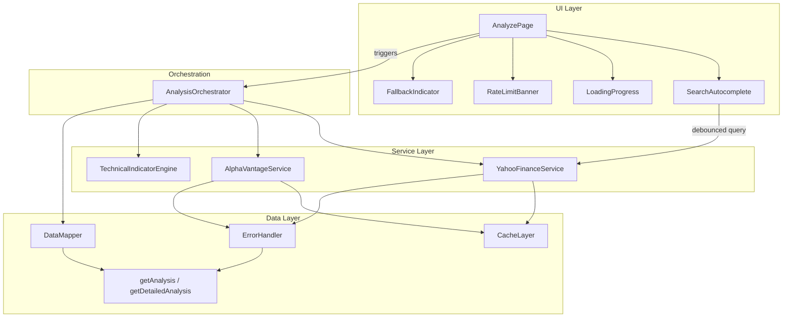
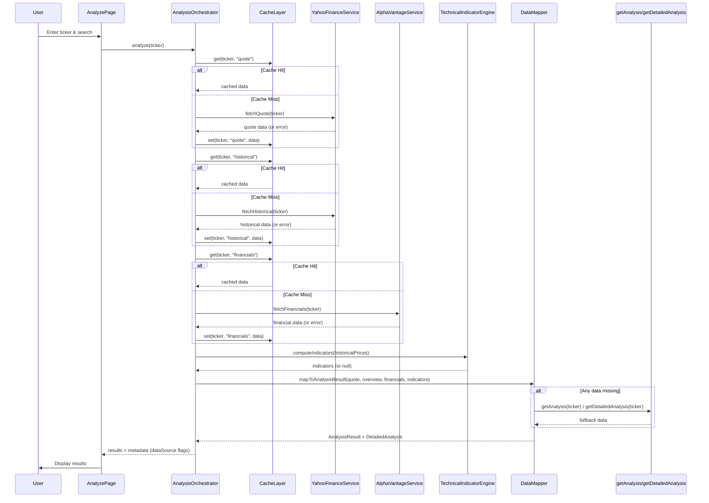

# Design Document: Free Data Integration

## Overview

This feature replaces the mock-only data layer with real market data from two free APIs: Yahoo Finance (via corsproxy.io CORS proxy, no API key) and Alpha Vantage free tier (25 requests/day). The architecture introduces a service layer, persistent caching, error handling with graceful fallback, client-side technical indicator computation, and search autocomplete — all while preserving the existing rule-based 4 Masters scoring logic and TypeScript types.

### Key Design Decisions

1. **Service Layer Pattern**: Each API gets its own service module (`YahooFinanceService`, `AlphaVantageService`) with a shared `CacheLayer` and `ErrorHandler`. Services are stateless functions, not classes.
2. **Cache-First Strategy**: All API calls check localStorage cache before making network requests. TTLs vary by data volatility (1 min for quotes, 1 hour for historical, 24 hours for financials).
3. **Graceful Degradation**: Every API call has a fallback path to existing mock data via `getAnalysis()`/`getDetailedAnalysis()`. The app never shows an error-only state.
4. **Data Mapper as Adapter**: A dedicated `DataMapper` module transforms raw API responses into existing `AnalysisResult` and `DetailedAnalysis` types, keeping the rest of the app unchanged.
5. **No Backend**: All requests go through corsproxy.io. The CORS proxy URL is a constant, not configurable by the user.
6. **Technical Indicators via Library**: The `technicalindicators` npm package handles EMA, RSI, and MACD computation — no custom math.

## Architecture



### Data Flow



## Components and Interfaces

### AnalysisOrchestrator

```typescript
// src/services/analysisOrchestrator.ts

interface AnalysisStage {
  id: string;
  label: string;
  status: 'pending' | 'loading' | 'success' | 'warning';
}

interface AnalysisProgress {
  stages: AnalysisStage[];
  currentStageIndex: number;
}

interface AnalysisOrchestratorResult {
  analysisResult: AnalysisResult;
  detailedAnalysis: DetailedAnalysis;
  dataSource: DataSourceInfo;
}

interface DataSourceInfo {
  quoteSource: 'live' | 'cached' | 'fallback';
  historicalSource: 'live' | 'cached' | 'fallback';
  financialsSource: 'live' | 'cached' | 'fallback';
  indicatorsComputed: boolean;
}

function analyzeStock(
  ticker: string,
  onProgress: (progress: AnalysisProgress) => void
): Promise<AnalysisOrchestratorResult>;
```

Responsibilities:
- Coordinates the multi-step analysis pipeline
- Reports progress to the UI via callback
- Handles partial failures by continuing to next stage
- Delegates data mapping and fallback logic to DataMapper

### YahooFinanceService

```typescript
// src/services/yahooFinanceService.ts

const CORS_PROXY_BASE = 'https://corsproxy.io/?';
const YAHOO_BASE_URL = 'https://query1.finance.yahoo.com';
const REQUEST_TIMEOUT_MS = 10000;

interface YahooQuoteResponse {
  symbol: string;
  shortName: string;
  longName?: string;
  regularMarketPrice: number;
  regularMarketChangePercent: number;
  marketCap: number;
  fiftyTwoWeekLow: number;
  fiftyTwoWeekHigh: number;
  regularMarketVolume: number;
  sector?: string;
}

interface YahooHistoricalPoint {
  date: string; // ISO date
  close: number; // adjusted close
}

interface YahooSearchResult {
  symbol: string;
  shortname: string;
  exchange: string;
  quoteType: string;
}

function fetchQuote(ticker: string): Promise<YahooQuoteResponse>;
function fetchHistorical(ticker: string): Promise<YahooHistoricalPoint[]>;
function searchTickers(query: string): Promise<YahooSearchResult[]>;
```

Responsibilities:
- Normalizes ticker to uppercase before all requests
- Constructs proxy URLs: `CORS_PROXY_BASE + encodeURIComponent(YAHOO_BASE_URL + path)`
- Applies 10-second timeout via AbortController
- Returns raw typed responses (mapping is done by DataMapper)
- No API key required

### AlphaVantageService

```typescript
// src/services/alphaVantageService.ts

const ALPHA_VANTAGE_BASE = 'https://www.alphavantage.co/query';

interface AlphaVantageFinancials {
  incomeStatement: AnnualReport[];
  balanceSheet: AnnualReport[];
  cashFlow: AnnualReport[];
}

interface AnnualReport {
  fiscalDateEnding: string;
  totalRevenue: string;
  netIncome: string;
  totalAssets: string;
  totalLiabilities: string;
  operatingCashflow: string;
  capitalExpenditures: string;
  [key: string]: string; // additional fields
}

interface AlphaVantageOverview {
  Symbol: string;
  Name: string;
  Sector: string;
  MarketCapitalization: string;
  PERatio: string;
  ProfitMargin: string;
  DebtToEquityRatio?: string;
  PEGRatio: string;
  PriceToSalesRatioTTM: string;
}

function fetchFinancials(ticker: string): Promise<AlphaVantageFinancials | null>;
function fetchOverview(ticker: string): Promise<AlphaVantageOverview | null>;
function isRateLimited(response: unknown): boolean;
```

Responsibilities:
- Reads API key from `import.meta.env.VITE_ALPHA_VANTAGE_KEY`
- Returns `null` if API key is not configured (no error shown)
- Detects rate limit responses (Alpha Vantage returns a JSON note about limit)
- Fetches most recent 4 annual periods for financial statements

### CacheLayer

```typescript
// src/services/cacheLayer.ts

type CacheDataType = 'quote' | 'historical' | 'financials' | 'overview';

interface CacheEntry<T> {
  data: T;
  timestamp: number; // Date.now() when stored
}

const TTL_CONFIG: Record<CacheDataType, number> = {
  quote: 60 * 1000,           // 1 minute
  historical: 60 * 60 * 1000, // 1 hour
  financials: 24 * 60 * 60 * 1000, // 24 hours
  overview: 24 * 60 * 60 * 1000,   // 24 hours
};

function buildCacheKey(ticker: string, dataType: CacheDataType): string;
function get<T>(ticker: string, dataType: CacheDataType): T | null;
function set<T>(ticker: string, dataType: CacheDataType, data: T): void;
function isExpired(entry: CacheEntry<unknown>, dataType: CacheDataType): boolean;
function clear(ticker?: string): void;
```

Responsibilities:
- Builds keys as `fdi:{TICKER}:{dataType}` (prefix prevents collision with other localStorage usage)
- Stores JSON-serialized `CacheEntry` objects in localStorage
- Returns `null` for expired or missing entries
- Falls back to in-memory `Map<string, CacheEntry>` if localStorage throws (quota exceeded, private browsing)
- `clear()` removes all cache entries (or entries for a specific ticker)

### ErrorHandler

```typescript
// src/services/errorHandler.ts

type ApiErrorType = 'NOT_FOUND' | 'NETWORK' | 'RATE_LIMIT' | 'TIMEOUT' | 'UNKNOWN';

interface ApiError {
  type: ApiErrorType;
  message: string;        // user-facing message
  technical: string;      // detailed error for console
}

function classifyError(error: unknown, context?: string): ApiError;
function isNetworkError(error: unknown): boolean;
function isTimeoutError(error: unknown): boolean;
function isNotFoundError(status: number): boolean;
```

Responsibilities:
- Classifies raw errors into typed `ApiError` objects
- Provides user-friendly messages per error type
- Logs technical details to `console.error`
- Does NOT throw — always returns a structured error object

Error message mapping:
| Type | User Message |
|------|-------------|
| NOT_FOUND | "Ticker symbol not recognized. Please check and try again." |
| NETWORK | "Network connection issue. Showing cached or estimated data." |
| RATE_LIMIT | "Daily API limit reached (25/day). Showing cached data." |
| TIMEOUT | "Request timed out. Showing cached or estimated data." |
| UNKNOWN | "Something went wrong. Showing estimated data." |

### TechnicalIndicatorEngine

```typescript
// src/services/technicalIndicatorEngine.ts

import { EMA, RSI, MACD } from 'technicalindicators';

interface IndicatorResults {
  ema12: number[];
  ema26: number[];
  rsi14: number[];
  macd: {
    macdLine: number[];
    signalLine: number[];
    histogram: number[];
  };
}

function computeIndicators(prices: number[]): IndicatorResults | null;
```

Responsibilities:
- Returns `null` if prices array has fewer than 26 data points
- Uses `technicalindicators` package for all computations
- EMA periods: 12 and 26
- RSI period: 14
- MACD: fast=12, slow=26, signal=9

### DataMapper

```typescript
// src/services/dataMapper.ts

import { AnalysisResult, DetailedAnalysis } from '../data/types';

interface RawApiData {
  quote: YahooQuoteResponse | null;
  historical: YahooHistoricalPoint[] | null;
  financials: AlphaVantageFinancials | null;
  overview: AlphaVantageOverview | null;
  indicators: IndicatorResults | null;
}

function mapToAnalysisResult(ticker: string, raw: RawApiData): AnalysisResult;
function mapToDetailedAnalysis(ticker: string, raw: RawApiData): DetailedAnalysis;
```

Responsibilities:
- Produces complete `AnalysisResult` and `DetailedAnalysis` objects
- Fills missing fields from `getAnalysis(ticker)` / `getDetailedAnalysis(ticker)` fallback
- Preserves existing rule-based scoring logic (calls existing scoring functions)
- Maps Yahoo Finance quote → `price`, `priceChange`, `companyName`, `quickFacts.marketCap`, `quickFacts.weekRange52`, `quickFacts.sector`
- Maps Alpha Vantage overview → `quickFacts.profitMargin`, `quickFacts.debtEquity`, `quickFacts.priceSales`
- Maps Alpha Vantage financials → `BuffettAnalysis.financialQuality`, `LynchAnalysis.pegAnalysis`
- Maps historical prices → `TechnicalAnalysis.chartData.pricePoints`
- Maps indicators → `TechnicalAnalysis.signals`

### SearchAutocomplete (Enhanced SearchInput)

```typescript
// src/components/SearchAutocomplete.tsx

interface SearchAutocompleteProps {
  value: string;
  onChange: (value: string) => void;
  onSearch: (ticker: string) => void;
}

interface AutocompleteItem {
  symbol: string;
  name: string;
  exchange: string;
}
```

Responsibilities:
- Extends existing `SearchInput` behavior (Enter key triggers search)
- Debounces search API calls by 300ms using a `useRef` timer
- Shows dropdown when input has 2+ characters and results are available
- Hides dropdown when input < 2 chars or user clicks outside (via `useEffect` click listener)
- Displays "No results found" when API returns empty array
- Selecting an item populates input and triggers `onSearch`

### LoadingProgress

```typescript
// src/components/LoadingProgress.tsx

interface LoadingProgressProps {
  stages: AnalysisStage[];
  currentStageIndex: number;
}
```

Responsibilities:
- Renders 5 stages vertically with status icons
- Pending: gray circle
- Loading: spinning blue indicator
- Success: green checkmark
- Warning: yellow warning icon (stage failed but continued)
- Animates transitions between stages

### RateLimitBanner

```typescript
// src/components/RateLimitBanner.tsx

interface RateLimitBannerProps {
  visible: boolean;
  onDismiss: () => void;
}
```

Responsibilities:
- Fixed-position banner at top of page (below nav)
- Yellow/amber warning styling
- Dismiss button (×) to close
- Does NOT block interaction (no overlay, no pointer-events blocking)
- Message: "Daily API limit reached (25 requests). Showing cached or estimated data."

### FallbackIndicator

```typescript
// src/components/FallbackIndicator.tsx

interface FallbackIndicatorProps {
  dataSource: DataSourceInfo;
}
```

Responsibilities:
- Small subtle badge/chip displayed near the analysis results
- Shows "Live data" (green), "Cached data" (blue), or "Estimated data" (gray) based on `dataSource`
- Only visible when at least one source is not 'live'

## Data Models

### Existing Types (Unchanged)

The feature preserves all existing types in `src/data/types.ts`:
- `AnalysisResult` — summary analysis with scores and quick facts
- `DetailedAnalysis` — full breakdown by each master's methodology
- All sub-types (`BuffettAnalysis`, `MungerAnalysis`, `LynchAnalysis`, `RothschildAnalysis`, `TechnicalAnalysis`)

### New Types

```typescript
// src/services/types.ts

// Cache entry wrapper
interface CacheEntry<T> {
  data: T;
  timestamp: number;
}

// Data source tracking
interface DataSourceInfo {
  quoteSource: 'live' | 'cached' | 'fallback';
  historicalSource: 'live' | 'cached' | 'fallback';
  financialsSource: 'live' | 'cached' | 'fallback';
  indicatorsComputed: boolean;
}

// Analysis orchestration
interface AnalysisStage {
  id: string;
  label: string;
  status: 'pending' | 'loading' | 'success' | 'warning';
}

// Error handling
type ApiErrorType = 'NOT_FOUND' | 'NETWORK' | 'RATE_LIMIT' | 'TIMEOUT' | 'UNKNOWN';

interface ApiError {
  type: ApiErrorType;
  message: string;
  technical: string;
}
```

## File Structure

```
src/
├── services/
│   ├── types.ts                    # Shared service types
│   ├── yahooFinanceService.ts      # Yahoo Finance API client
│   ├── alphaVantageService.ts      # Alpha Vantage API client
│   ├── cacheLayer.ts               # localStorage cache with TTL
│   ├── errorHandler.ts             # Error classification
│   ├── technicalIndicatorEngine.ts # EMA, RSI, MACD computation
│   ├── dataMapper.ts               # API response → existing types
│   └── analysisOrchestrator.ts     # Multi-step pipeline coordinator
├── components/
│   ├── SearchAutocomplete.tsx      # Enhanced search with dropdown
│   ├── LoadingProgress.tsx         # Multi-step progress indicator
│   ├── RateLimitBanner.tsx         # Rate limit warning banner
│   └── FallbackIndicator.tsx       # Data source indicator badge
├── data/                           # Existing (unchanged)
│   ├── types.ts
│   ├── getAnalysis.ts
│   ├── getDetailedAnalysis.ts
│   ├── mockData.ts
│   ├── generatePlaceholder.ts
│   └── generateDetailedPlaceholder.ts
└── pages/
    └── AnalyzePage.tsx             # Updated to use orchestrator
```

## Environment Configuration

```bash
# .env.example
# Alpha Vantage API Key (free tier, 25 requests/day)
# Get your free key at: https://www.alphavantage.co/support/#api-key
VITE_ALPHA_VANTAGE_KEY=your_api_key_here
```

The app works without this key — Yahoo Finance data and mock fallback will be used for financial statements.

## Error Handling

| Scenario | Service | Behavior |
|----------|---------|----------|
| Yahoo quote 404 | YahooFinanceService | ErrorHandler classifies as NOT_FOUND, DataMapper uses fallback |
| Yahoo timeout (>10s) | YahooFinanceService | AbortController cancels, ErrorHandler classifies as TIMEOUT |
| CORS proxy down | YahooFinanceService | ErrorHandler classifies as NETWORK, DataMapper uses fallback |
| Alpha Vantage rate limit | AlphaVantageService | ErrorHandler classifies as RATE_LIMIT, shows banner, uses cache/fallback |
| Alpha Vantage no API key | AlphaVantageService | Skips fetch entirely, returns null, DataMapper uses fallback |
| localStorage full | CacheLayer | Falls back to in-memory Map, logs warning |
| Insufficient price data (<26 points) | TechnicalIndicatorEngine | Returns null, DataMapper uses fallback signals |
| All APIs fail | AnalysisOrchestrator | DataMapper falls back entirely to getAnalysis()/getDetailedAnalysis() |

### Design Principle: Never Block the User

Every failure path leads to a complete `AnalysisResult` and `DetailedAnalysis`. The user always sees results — the only difference is whether data is live, cached, or estimated (indicated by the FallbackIndicator badge).


## Correctness Properties

*A property is a characteristic or behavior that should hold true across all valid executions of a system — essentially, a formal statement about what the system should do. Properties serve as the bridge between human-readable specifications and machine-verifiable correctness guarantees.*

### Property 1: Ticker normalization idempotence

*For any* string used as a ticker input to `YahooFinanceService.fetchQuote`, the ticker passed to the underlying HTTP request SHALL be the uppercase-trimmed version of the input. Applying normalization twice produces the same result as applying it once: `normalize(normalize(t)) === normalize(t)`.

**Validates: Requirements 1.4**

### Property 2: Cache TTL correctness

*For any* cache entry stored with a timestamp `T` and a data type with TTL `D`, calling `get()` at time `T + dt` SHALL return the cached data if `dt < D`, and SHALL return `null` if `dt >= D`.

**Validates: Requirements 7.1, 7.2, 7.3, 7.4, 7.5**

### Property 3: Cache key uniqueness

*For any* two distinct `(ticker, dataType)` pairs where either the ticker or the data type differs, `buildCacheKey(ticker1, dataType1) !== buildCacheKey(ticker2, dataType2)`. Additionally, every stored cache entry SHALL include a numeric `timestamp` field.

**Validates: Requirements 7.6, 7.7**

### Property 4: Error handler structural consistency

*For any* error input (Error object, string, unknown value, or HTTP status code), `classifyError()` SHALL return an `ApiError` object containing exactly three fields: `type` (one of the defined ApiErrorType values), `message` (non-empty string), and `technical` (non-empty string).

**Validates: Requirements 8.2, 8.4**

### Property 5: Fallback completeness

*For any* ticker string and any combination of API failures (quote fails, historical fails, financials fail, all fail), the `AnalysisOrchestrator` SHALL always produce a valid `AnalysisResult` with all required fields populated (ticker, companyName, price, masterScores, quickFacts) — never null, never throwing.

**Validates: Requirements 1.3, 8.5, 12.1, 12.4**

### Property 6: Data mapper produces complete AnalysisResult

*For any* valid combination of raw API data (including partial data where some sources are null), `mapToAnalysisResult()` SHALL return an `AnalysisResult` object with all required fields populated. No field SHALL be undefined or null.

**Validates: Requirements 13.1, 13.4, 13.5**

### Property 7: Data mapper produces complete DetailedAnalysis

*For any* valid combination of raw API data (including partial data where some sources are null), `mapToDetailedAnalysis()` SHALL return a `DetailedAnalysis` object containing all five sub-analyses (buffettAnalysis, mungerAnalysis, lynchAnalysis, rothschildAnalysis, technicalAnalysis) with all required fields populated.

**Validates: Requirements 13.2, 13.3**

### Property 8: Historical data chronological ordering

*For any* successful response from `fetchHistorical()`, the returned array of `YahooHistoricalPoint` objects SHALL be sorted in ascending order by date (oldest first, newest last). Formally: for all indices `i < j`, `points[i].date <= points[j].date`.

**Validates: Requirements 2.2**

### Property 9: RSI range invariant

*For any* array of prices with length >= 15 (14-period RSI needs at least 15 data points), all computed RSI values SHALL be in the range [0, 100] inclusive.

**Validates: Requirements 10.2**

### Property 10: MACD histogram invariant

*For any* array of prices with length >= 35 (26-period EMA + 9-period signal), for all indices `i` in the computed MACD result, `histogram[i]` SHALL equal `macdLine[i] - signalLine[i]` (within floating-point tolerance of ±0.0001).

**Validates: Requirements 10.3**

### Property 11: Insufficient data returns null

*For any* array of prices with length < 26, `computeIndicators(prices)` SHALL return `null`.

**Validates: Requirements 10.5**

### Property 12: Proxy URL construction correctness

*For any* Yahoo Finance API path string, the constructed proxy URL SHALL equal `CORS_PROXY_BASE + encodeURIComponent(YAHOO_BASE_URL + path)`, and SHALL be a valid URL parseable by the `URL` constructor.

**Validates: Requirements 14.1, 14.2**

## Testing Strategy

### Unit Tests (Example-Based)

| Component/Module | Test Cases |
|-----------------|------------|
| SearchAutocomplete | Renders input; shows dropdown at 2+ chars; hides at <2 chars; debounces 300ms; selects item; shows "No results"; closes on outside click |
| LoadingProgress | Renders 5 stages; highlights current; shows success/warning icons |
| RateLimitBanner | Shows when visible=true; hides on dismiss; doesn't block interaction |
| FallbackIndicator | Shows correct badge per data source combination |
| AlphaVantageService | Skips fetch when no API key; detects rate limit response; returns null on missing key |
| YahooFinanceService | Constructs correct proxy URL; applies 10s timeout; handles 404 |
| AnalysisOrchestrator | Progresses through stages; handles partial failures; reports progress |
| DataMapper | Maps known API response to correct AnalysisResult fields; uses fallback for missing data |

### Property-Based Tests

| Property | Test Description | Min Iterations |
|----------|-----------------|----------------|
| Property 1: Ticker normalization | Generate arbitrary strings, verify normalization is idempotent and produces uppercase | 100 |
| Property 2: Cache TTL | Generate random timestamps and TTL offsets, verify cache hit/miss logic | 100 |
| Property 3: Cache key uniqueness | Generate pairs of (ticker, dataType), verify distinct inputs produce distinct keys | 100 |
| Property 4: Error handler structure | Generate various error inputs (Error objects, strings, numbers), verify output shape | 100 |
| Property 5: Fallback completeness | Generate random tickers with mocked failing services, verify complete result | 100 |
| Property 6: AnalysisResult completeness | Generate random partial API data, verify all AnalysisResult fields are populated | 100 |
| Property 7: DetailedAnalysis completeness | Generate random partial API data, verify all DetailedAnalysis sub-analyses present | 100 |
| Property 8: Chronological ordering | Generate random date-price arrays, verify output is sorted ascending | 100 |
| Property 9: RSI range | Generate random price arrays (length >= 15), verify RSI ∈ [0, 100] | 100 |
| Property 10: MACD histogram | Generate random price arrays (length >= 35), verify histogram = MACD - signal | 100 |
| Property 11: Insufficient data | Generate random price arrays (length < 26), verify null return | 100 |
| Property 12: Proxy URL | Generate random path strings, verify URL construction and validity | 100 |

**Library**: `fast-check` (already installed)
**Runner**: `vitest --run`

**Tag format**: Each property test includes:
```
// Feature: free-data-integration, Property {N}: {property_text}
```

### Integration Tests

- End-to-end flow: search → loading → results with mocked fetch
- Rate limit banner appears when Alpha Vantage returns limit response
- Fallback indicator shows correct state for mixed data sources
- Cache persists across simulated page refreshes (localStorage mock)

### Test Tools

- **Test runner**: Vitest
- **Component testing**: React Testing Library
- **Property testing**: fast-check
- **HTTP mocking**: `vi.fn()` / `vi.spyOn(globalThis, 'fetch')` for service tests
- **localStorage mocking**: Custom mock for cache layer tests
